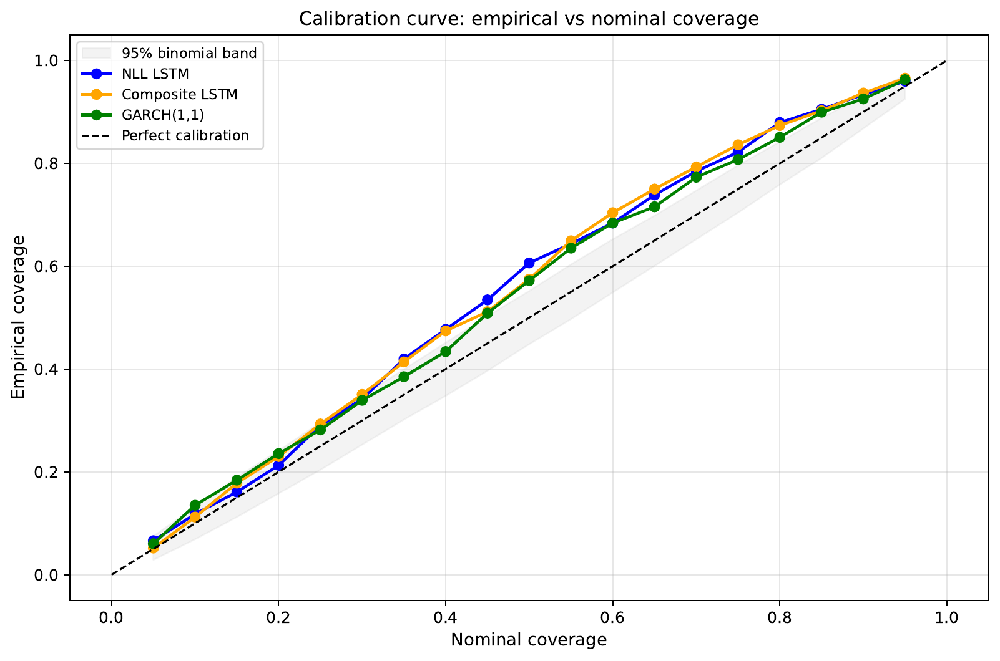

# Probabilistic WTI Return Forecasting

[](https://github.com/PeterLP123/wti-return-forecasting/actions/workflows/ci.yml)
[](https://www.python.org/)
[](notebooks/daily)

A time-series research project on next-day West Texas Intermediate (WTI) crude-oil returns. It compares probabilistic LSTMs with XGBoost, AR, naive, and GARCH benchmarks, then tests whether the LSTM uncertainty estimates are actually calibrated.



## Research question

Do heteroscedastic LSTMs produce statistically calibrated uncertainty estimates for next-day WTI returns, and do they improve on a classical GARCH(1,1) benchmark?

The target is the next-day log return

```text
r(t+1) = log(P(t+1)) - log(P(t))
```

The modelling panel covers 31 January 2017 to 3 March 2026. Evaluation uses a chronological split to prevent look-ahead leakage:

| Split | Period | Observations in the calibration study |
|---|---|---:|
| Train | through 30 December 2022 | 1,235 |
| Validation | 3 January 2023 – 28 June 2024 | 312 |
| Test | 1 July 2024 – 3 March 2026 | 348 |

## Main findings

- The pure-NLL LSTM is only partially calibrated: its standardised residuals are close to unit scale, but tail fit and interval independence remain imperfect.
- The composite direction-aware loss improves directional accuracy in the original modelling exercise (52.3% versus 47.1% for pure NLL), but its predicted uncertainty is over-dispersed and should not be interpreted as a calibrated standard deviation.
- Replacing the Gaussian residual law with a post-hoc Student-t law improves average negative log-likelihood for all three probabilistic models.
- The NLL LSTM does not significantly outperform GARCH on daily log score (`p = 0.67`); GARCH is marginally stronger across the full calibration scorecard.

| Model | Gaussian NLL | Student-t NLL | Residual SD | Overall assessment |
|---|---:|---:|---:|---|
| Pure-NLL LSTM | 1.842 | 1.820 | 1.07 | Partially calibrated |
| Composite LSTM | 1.979 | 1.952 | 0.83 | Not calibrated |
| GARCH(1,1) | 1.865 | 1.833 | 1.02 | Best calibrated |

The complete methodology, diagnostics, limitations, and references are in the [individual report](report/individual_report.pdf). Its [LaTeX source](report/individual_report.tex) and referenced figures are versioned alongside the PDF.

## Repository layout

```text
.
├── data/
│   └── README.md                         # expected inputs and generated datasets
├── docs/assets/
│   └── calibration_curve.png             # README figure
├── notebooks/daily/
│   ├── data_processing.ipynb             # refresh market prices and build base data
│   ├── data_analysis.ipynb               # exploratory analysis
│   ├── feature_engineering.ipynb         # core, full, and PCA feature sets
│   └── return_prediction/
│       ├── lstm_model.ipynb               # model training and comparison
│       └── probabilistic_calibration_study.ipynb
├── report/
│   ├── figures/                          # figures referenced by the report
│   ├── individual_report.pdf
│   ├── individual_report.tex
│   └── references.bib
├── scripts/
│   └── grid_search_nll.py                # resumable XGBoost/LSTM grid search
├── tests/
│   └── test_repository.py                # structural and notebook checks
└── requirements.txt
```

## Data

The research combines market prices, EIA inventory measures, Federal Reserve text features, and GDELT sentiment aggregates for 12 oil-relevant countries. The consolidated datasets are not redistributed in this portfolio repository because they contain third-party-derived inputs. See [data/README.md](data/README.md) for the expected filenames, schemas, and generated artifacts.

Notebook outputs and the final report are retained so the analysis can be reviewed without the private working data.

## Reproducing the analysis

1. Clone the repository and create an environment:

   ```bash
   git clone https://github.com/PeterLP123/wti-return-forecasting.git
   cd wti-return-forecasting
   python -m venv .venv
   source .venv/bin/activate
   python -m pip install --upgrade pip
   pip install -r requirements.txt
   ```

2. Place the private source datasets in the locations documented in [data/README.md](data/README.md).

3. Build the feature datasets, explore them, and run the main modelling notebook:

   ```bash
   jupyter lab
   ```

   - `data_processing.ipynb`
   - `feature_engineering.ipynb`
   - `data_analysis.ipynb`
   - `return_prediction/lstm_model.ipynb`

4. Generate the canonical NLL and composite-model artifacts consumed by the calibration study. From the repository root, run:

   ```bash
   python scripts/grid_search_nll.py
   ```

   This is computationally expensive and writes checkpoints and metrics to `results/nll_grid/`.

5. Run `return_prediction/probabilistic_calibration_study.ipynb` to reproduce the formal calibration diagnostics and report figures.

The preprocessing code fits `RobustScaler` objects on the training split only and applies them unchanged to validation and test data.

## Validation

Repository checks validate Python syntax, notebook JSON, recorded notebook errors, report assets, and common submission debris:

```bash
pip install -r requirements-dev.txt
pytest -q
```

The report can be rebuilt independently with:

```bash
cd report
latexmk -pdf -interaction=nonstopmode -halt-on-error individual_report.tex
```

## Scope

This is an academic research project, not investment advice or a production trading system. The reported backtests and calibration diagnostics are historical and do not establish future profitability.
